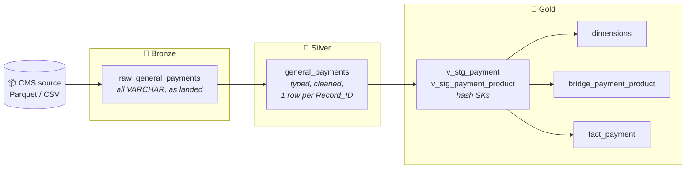
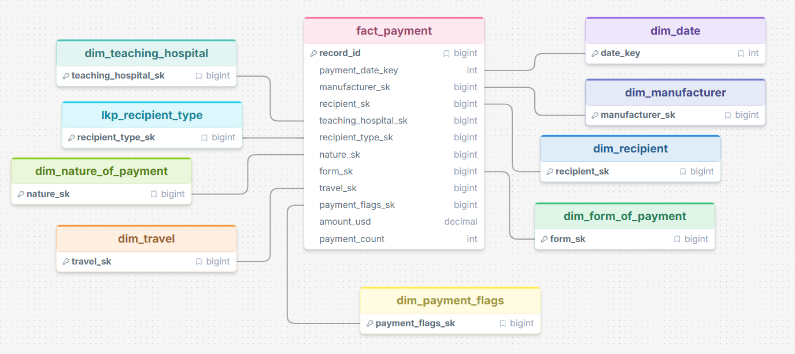
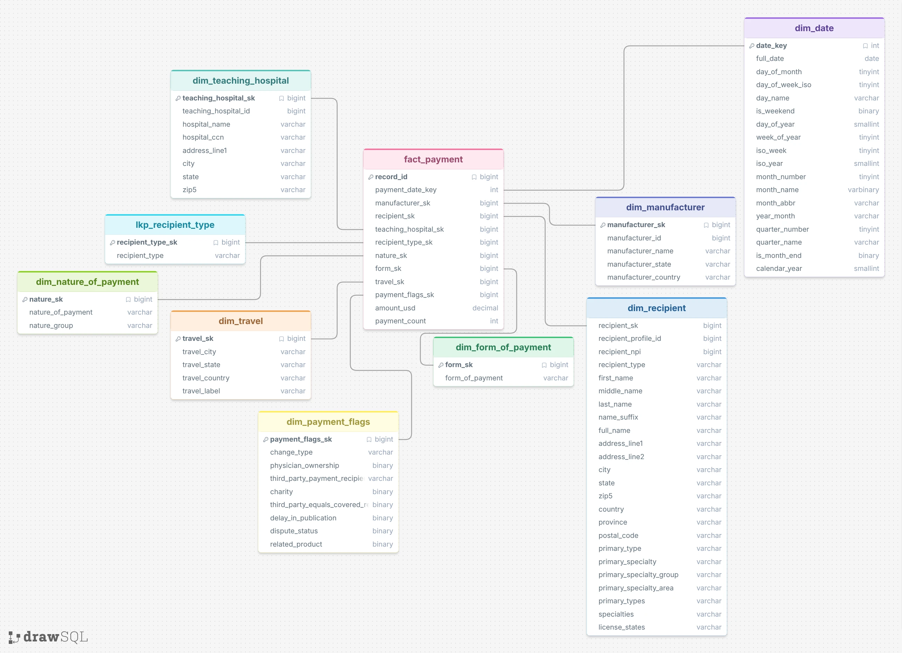
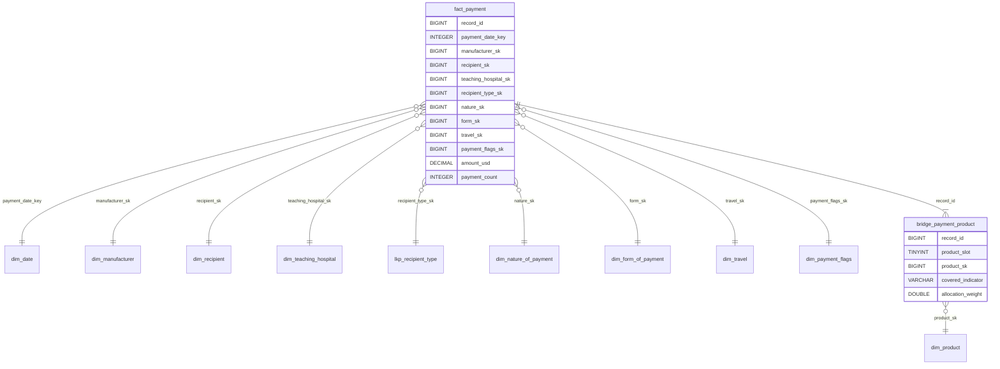

<div align="center">

# 🏥 cms-open-payments-warehouse

**A DuckDB star schema of CMS Open Payments: General Payments, Program Year 2025**
*Built as a hands-on data-modeling learning project.*


</div>

---

## 📊 At a glance

| 🧾 Payment records | 💵 Total paid | 🏭 Manufacturers | 👩‍⚕️ Recipients | 🏨 Teaching hospitals | 💊 Products |
|:---:|:---:|:---:|:---:|:---:|:---:|
| **16.1M** | **$3.92B** | **1,756** | **~1.02M** | **1,296** | **9,765** |

---

## 📚 Table of contents

- [Project overview](#-project-overview)
- [Stack](#️-stack)
- [Architecture](#️-architecture)
- [Data model](#-data-model)
- [Modeling decisions](#-modeling-decisions)
- [Repo structure](#-repo-structure)
- [How to run](#️-how-to-run)
- [Analysis](#-analysis)
- [Known issues & next steps](#-known-issues--next-steps)
- [Data source](#-data-source)

---

## 🧭 Project overview

[CMS Open Payments](https://openpaymentsdata.cms.gov/) is a US federal dataset that discloses payments from drug and medical-device manufacturers to physicians, non-physician practitioners and teaching hospitals. The PY2025 General Payments file has **~16.1M rows across 91 columns**, all in one flat table.

This project turns that flat file into a **dimensional model** that answers business questions with simple joins. The point was to **learn dimensional modeling on real, messy data**:

- 🧱 Layer the pipeline (bronze → silver → gold) so each step has one job.
- ⭐ Design a star schema: choose the grain, the dimensions, a junk dimension, a bridge for many-to-many and the SCD handling.
- 🔑 Use deterministic surrogate keys so the model can be fully reloaded.
- 📈 Prove the model by answering real [business questions](analysis/Business%20Questions%201.docx).

**Grain of the fact table:** one row per payment record (`Record_ID`).

---

## 🛠️ Stack

| Tool | Used for |
|---|---|
| 🦆 **DuckDB CLI 1.5.5** | Storage and compute: a single-file analytical database |
| 🧮 **Plain SQL** | DDL, transforms and analysis. No application code and no build step |
| 📦 **Parquet / CSV** | Source files (Parquet ~700 MB, raw CSV ~9 GB) |
| 🎨 **drawSQL** | Early schema sketch |
| 🖼️ **Diagram images** | Conceptual and logical models in [`models/`](models/) |

---

## 🏗️ Architecture

Medallion layers with a **full refresh**: each layer reloads in its own transaction (truncate, then `INSERT ... BY NAME`).



| Layer | Table(s) | What happens |
|---|---|---|
| 🥉 **Bronze** | `bronze.raw_general_payments` | The source is landed as-is. Every column is `VARCHAR`, plus `_source_file` and `_loaded_at` |
| 🥈 **Silver** | `silver.general_payments` | `TRY_CAST` typing, the `clean_str` / `to_date` / `to_bool` macros, and dedupe to one row per `Record_ID` |
| 🥇 **Gold** | `gold.fact_payment` + dims, lookup, bridge | The star schema. Staging views compute the surrogate keys and are materialized once per load |

---

## ⭐ Data model

<table>
<tr>
<td align="center"><b>Conceptual</b></td>
<td align="center"><b>Logical</b></td>
</tr>
<tr>
<td></td>
<td></td>
</tr>
</table>

### Physical star schema (as built)



<details>
<summary>📏 <b>Table sizes</b> (row counts include the -1 / -2 reserved members)</summary>

| Table | Type | Rows |
|---|---|---:|
| `fact_payment` | Fact | 16,131,856 |
| `bridge_payment_product` | Bridge | 19,470,697 |
| `dim_recipient` | Dimension (SCD1) | 1,022,577 |
| `dim_product` | Dimension | 9,767 |
| `dim_travel` | Dimension | 9,288 |
| `dim_manufacturer` | Dimension (SCD1) | 1,758 |
| `dim_teaching_hospital` | Dimension (SCD1) | 1,298 |
| `dim_date` | Dimension | 366 |
| `dim_payment_flags` | Junk dimension | 103 |
| `dim_nature_of_payment` | Dimension | 17 |
| `dim_form_of_payment` | Dimension | 7 |
| `lkp_recipient_type` | Lookup | 4 |

</details>

---

## 🧠 Modeling decisions

| # | Decision | Why |
|:-:|---|---|
| 1 | **Grain = one row per `Record_ID`** | It's the atomic disclosure unit in the source. Everything else can be rolled up from it |
| 2 | **Fact holds keys and measures only** (no `VARCHAR`) | Keeps the 16M-row fact narrow. Names and free text stay in `silver.general_payments`; join on `record_id` = `Record_ID` |
| 3 | **Deterministic hash surrogate keys** (`gold.sk` = md5 of the natural key parts → positive `BIGINT`) | A full reload reproduces identical keys. No sequences, and dims and fact can load in any order |
| 4 | **Reserved members `-1` Unknown / `-2` Not Applicable** | Every FK is `NOT NULL` and always joins. Individual payments get `teaching_hospital_sk = -2`; hospital payments get `recipient_sk = -2` |
| 5 | **SCD Type 1** for manufacturer, recipient and hospital | Attributes come from the most recent payment. Simple, and enough for one program year |
| 6 | **`lkp_recipient_type` keyed on the fact** | Recipient type *as of the payment*. The SCD1 `dim_recipient.recipient_type` differs on ~0.4% of payments |
| 7 | **Junk dimension `dim_payment_flags`** | Folds the low-cardinality Yes/No indicator columns into 103 combinations instead of many tiny dims |
| 8 | **Bridge table for products** with `allocation_weight = 1/n` | A payment can list up to 5 products (many-to-many). Weighting avoids double-counting `amount_usd`. Payments with no product get one `-2` row |
| 9 | **`dim_date` keyed by `YYYYMMDD` integer** | Readable and sortable, and needs no lookup to build the key |
| 10 | **`TRY_CAST` in silver, `NOT NULL` on fact measures** | Tolerant cleaning never aborts on a bad value, but a truly broken record fails the load loudly instead of being defaulted |
| 11 | **Dedupe with a semi-join on `max(rowid)`**, not a window function | A window over the full 91-column rows ran out of memory at 16M rows |

---

## 📁 Repo structure

```text
cms-open-payments-warehouse/
├── 📂 sql/                          # Warehouse DDL and gold load scripts
│   ├── 02_ddl_bronze.sql            #   bronze landing table (all VARCHAR)
│   ├── 02_ddl_silver.sql            #   silver typed table
│   ├── 02_ddl_gold.sql              #   gold star-schema tables
│   ├── 03_load_gold_lookup.sql      #   lkp_recipient_type load
│   ├── 03_load_gold_dims.sql        #   all dimensions + reserved members
│   └── 03_load_gold_fact.sql        #   fact_payment load
├── 📂 analysis/
│   ├── Answers.sql                  # SQL answers to the business questions
│   ├── Business Questions 1.docx    # The questions the model must answer
│   └── 📂 visuals/                  # One chart per question (PNG)
├── 📂 models/
│   ├── conceptual.png               # Conceptual model
│   └── logical.webp                 # Logical model
├── 📂 data/
│   └── README.md                    # Link to the source dataset (data not committed)
├── 📂 docs/                         # (reserved for documentation)
└── requirements.txt
```

---

## ▶️ How to run

**Prerequisites**

- [DuckDB CLI](https://duckdb.org/docs/installation/) (v1.5.5)
- The PY2025 General Payments file from [CMS Open Payments](https://openpaymentsdata.cms.gov/dataset/fb0b1734-1410-429d-92f6-3f4b35218e5e#overview)

**1. Create the schemas and tables**

```sh
duckdb -bail modeling.db < sql/02_ddl_bronze.sql
duckdb -bail modeling.db < sql/02_ddl_silver.sql
duckdb -bail modeling.db < sql/02_ddl_gold.sql
```

**2. Load gold** (once silver is loaded)

```sh
duckdb -bail modeling.db < sql/03_load_gold_lookup.sql
duckdb -bail modeling.db < sql/03_load_gold_dims.sql
duckdb -bail modeling.db < sql/03_load_gold_fact.sql
```

> [!NOTE]
> The **bronze/silver load**, the **silver/gold macros** (`clean_str`, `to_date`, `to_bool`, `sk`, `norm_upper`, `recipient_type`), the **gold staging views** (`v_stg_payment`, `v_stg_payment_product`) and the **validation script** are not in this repo yet. Step 2 depends on them. See [Known issues & next steps](#-known-issues--next-steps).

**3. Query it**

```sh
duckdb -readonly modeling.db < analysis/Answers.sql
```

> [!TIP]
> When splitting amounts by product, always weight by the bridge:
> `sum(f.amount_usd * b.allocation_weight)`.

---

## 📈 Analysis

Eight business questions, answered in [`analysis/Answers.sql`](analysis/Answers.sql) and charted below.

#### 1. Which manufacturers are making the highest payments to physicians?


#### 2. Which physicians received the highest total payments?


#### 3. What type of payment is most common?


#### 4. Which states have the highest payment activity?


#### 5. What is the trend of payments over time?


#### 6. Which medical specialties receive the highest payments?


#### 7. Which drugs or medical products are linked with the highest payments?


#### 8. Which payment categories are increasing or decreasing over time?


---

## ✅ Known issues & next steps

- [ ] Add the bronze/silver load script (`03_load` sections 1–2) to `sql/`
- [ ] Add the macros and staging-view DDL (`silver.*` and `gold.*` macros, `gold.v_stg_payment*`)
- [ ] Add the validation script (`04_validate.sql`)
- [ ] Switch question 1 in `Answers.sql` from `dim_recipient.recipient_type` to `lkp_recipient_type` (as-of type, see decision #6)
- [ ] Fill in or remove the empty `requirements.txt`
- [ ] Note that the early drawSQL sketch doesn't match the built gold schema (FK direction, the unbuilt `dim_speciality`)

---

## 🙏 Data source

Data: [CMS Open Payments, General Payments, Program Year 2025](https://openpaymentsdata.cms.gov/dataset/fb0b1734-1410-429d-92f6-3f4b35218e5e#overview), published by the U.S. Centers for Medicare & Medicaid Services. The raw data is not committed to this repo.

<div align="center">

Made by **Musab Albusaidi** as part of data-modeling learning sessions 🎓

</div>
